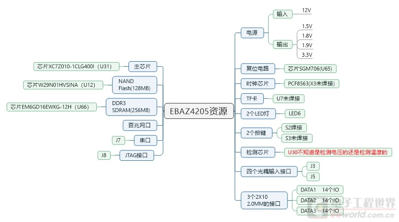
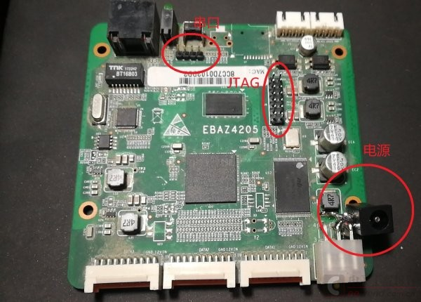
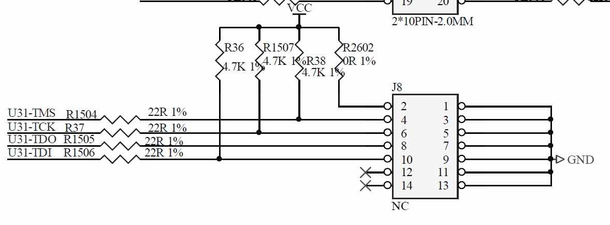

# 矿板的自我修养——EBAZ4205

学习FPGA与软件不同，你需要一块开发板。然而在某宝上找到的最便宜的核心板不仅要99r，而且还是Spartan-6，只能使用老旧的ISE作为开发套件。如果想要使用ZYNQ，则最便宜的核心板要299r，即使一块ZYNQ7010的芯片单买都要接近100r。这对于学生党来说，尤其是社团经费不足的情况下，是一笔不小的开销。

当然，正如本文的内容，总归有少花钱的办法。但是，电子产品总归是越贵越好，要么花钱，要么花时间。学生党的时间总是不值钱的（未必），然而钱总是值钱的。本文介绍了一块矿板的使用与注意事项。

> 请不要在寝室里使用电烙铁、热风枪。尤其是不要使用酒精喷灯！  
> 如需使用可以申请信院Geekpie实验室的使用

## 准备

材料：EBAZ4205（大约35r）、排针、杜邦线

仪器：电烙铁、12v电源（可以使用直流稳压电源或废弃充电器）、Xilinx下载器、串口读取设备（示波器就可以）

在使用EBAZ4205前有必要了解一下这块板。这块板是某矿机上的控制板，包含了一块Xilinx ZYNQ 7010的芯片，也就是我们想要的。其他资源见下图

## 焊接

这块板有很多问题，因为并非设计来开发。比如PL（可编程逻辑）的晶振是没有焊接的，因此不能单独使用PL。当然可以飞线从PS的晶振给它时钟，但这样传输高频信号是一种作死的行为。反正学习ZYNQ不可能只用PL，可以通过PS提供一个信号给PL。比如SD卡槽是没有焊接的，如果想从SD卡启动，不仅需要焊接卡槽，还需要修改电阻（短接也可以），很麻烦。

本文仅仅焊接了JTAG和串口，这是最安全的方式，可以满足大部分需求。甚至电源直接通过原有供电口供电，就不需要重新焊接二极管（把二极管换成导线很作死）。

## 供电

由于这块板并不是通过那个像电源插口的地方供电的，所以那块的二极管没有焊接。一种做法是将另外IO口的二极管拆下来再重新焊上去，当然，为了省事。这里就直接用IO口供电。

解决方式很粗暴，注意到每个IO口的右边的PCB版上都有标注GND和12V。只要拿一个公-母的杜邦线插进去。本文采用直流稳压电源供电，于是用鳄鱼夹夹住两条线就可以成功启动了。

## 串口

在启动后串口应该会有输出，可以以此检查板子的完好性。由于没有串口转usb的工具，本文使用示波器自带的解码工具解码。波特率115200，8位数据位，1位停止位，无校验位。如果能解码出人类可以理解的文字，那么多半是没有问题的。串口自右向左，分别为GND，TXD，RXD。板子上有标注。

## JTAG

JTAG的线序是我们要重点关注的，因为板子上没有标注。当然很简单，因为我们有原理图。

而且PCB板上很良心的标注了引脚的顺序，可以看到有一个小三角的那里就是1。我们还可以通过分布来确定引脚的顺序，观察到2，4，6，8，10接到了一堆电阻上，而J8旁边有一堆电阻，通过走线就可以推断哪一排是偶数排。和PCB标注的结果一致。

## 内存

在Vivado中使用ZYNQ processor的ip核时，一定要注意改变内存的参数。由于ZYNQ上的内存不是预制的，需要选取相近参数。这里参考这篇文章，就不细说了

> https://www.bilibili.com/read/cv4801574?from=search

> Reference  
> http://bbs.eeworld.com.cn/thread-1079275-1-1.html  
> http://bbs.eeworld.com.cn/thread-1079271-1-1.html  
> https://www.bilibili.com/video/BV1nE411s7hR
