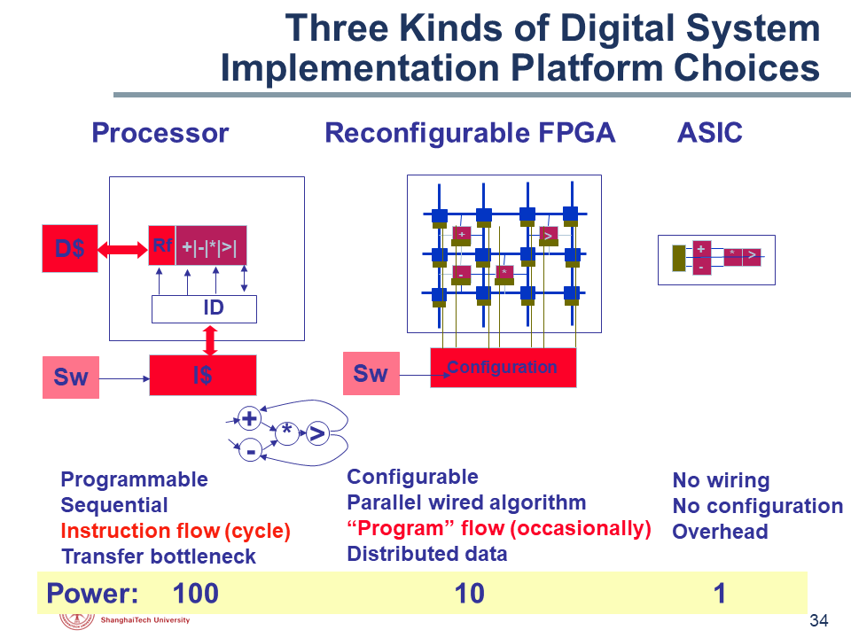

# FPGA Tutorial
> 教程仍然处于编写与修改中，受限于作者对于这个领域的理解水平，很可能会存在错误。如果你发现了任何错误，欢迎发起一个issue。  
> 请访问 https://shanghaitechgeekpie.github.io/FPGA-tutorial/#/ 阅读本教程

FPGA是现场可编程门阵列(**F**ield **P**rogrammable **G**ate **A**rray)的简称。

### 现场可编程
FPGA是可以重复编程以实现不同功能的器件

### 门
FPGA所能编程实现的最小单元是门电路，比如通过编程实现一个与门

### 阵列
FPGA主要是由许多可编程逻辑块(**C**onfigurable **L**ogic **B**lock)组成的

FPGA是通用性与专用性妥协的产物。它相比于通用计算机更加专用，因此速度与吞吐量更大，功耗更低。它相比于专用集成电路ASIC，以高功耗与大面积换取通用性。

这个教程使用Xilinx的开发套件Vivado进行开发，所有工程文件都可以在src文件夹中找到。本教程包括：

- LED闪烁 FPGA开发流程简介
- verilog语法简介

如果读者在掌握了FPGA的一些用法后仍对FPGA有所兴趣，我校开设了几门与FPGA相关的课程，它们是：

- EE116 基于FPGA的硬件系统设计
- EE113 数字集成电路I
- EE216 可重构计算

> 引用  
> EE115 Topic 1 Introduction.ppt p34