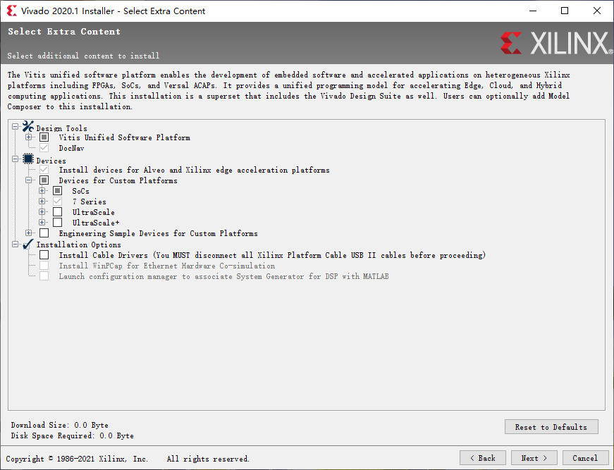
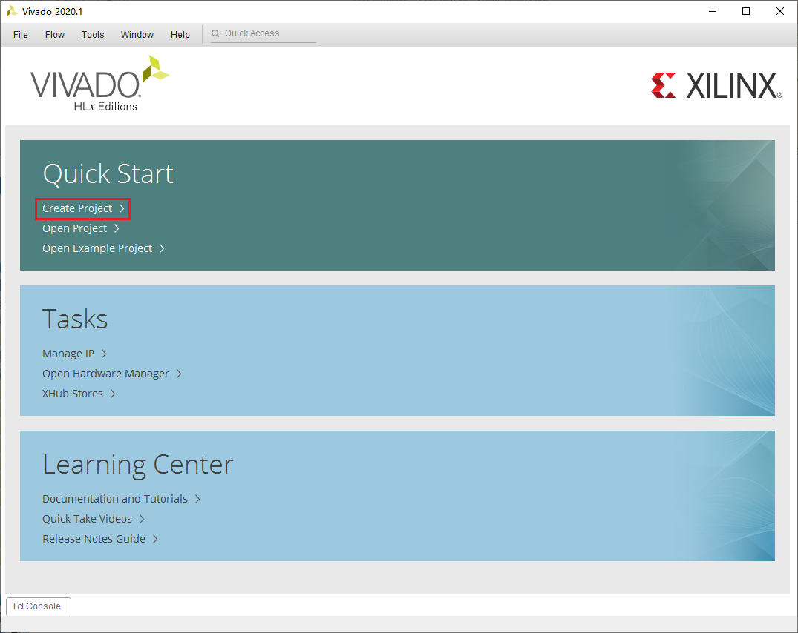
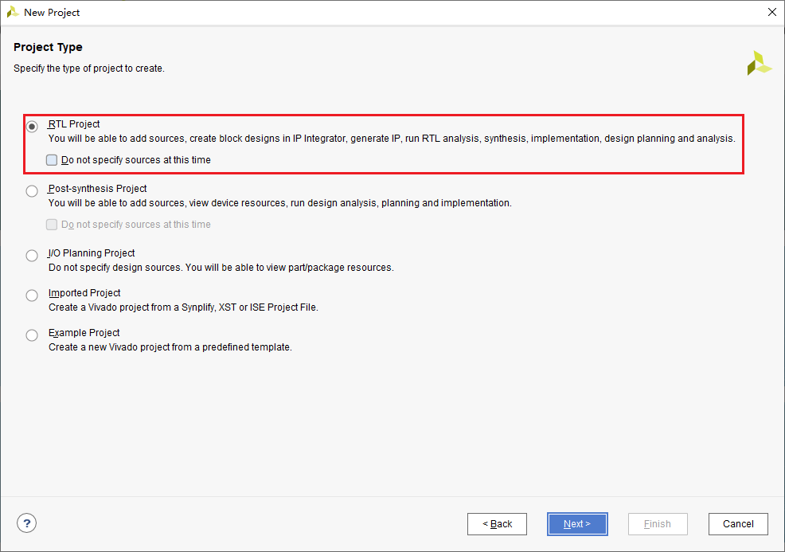
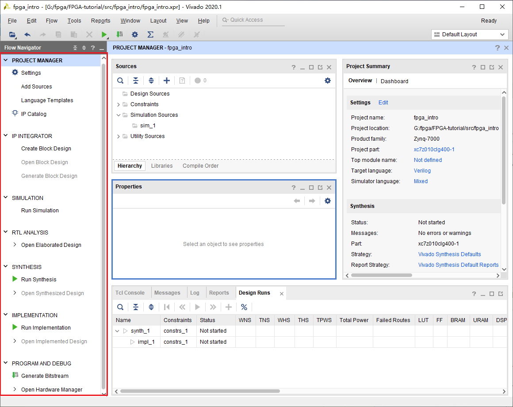

# Intro to 嵌入式点灯工程师
在开始正式学习FPGA前，我们先通过一个简单的例子来看看FPGA的开发流程是怎样的，FPGA与单片机又有什么区别。

## 开发板的选购
FPGA的主要厂商包括Altera与Xilinx，至少在以前是这样的。然后在某一天Altera被Intel收购了，接着Xilinx被AMD收购了。于是这又变成牙膏厂和农企之间的争斗了。

由于FPGA并不像软件开发拥有众多的开源项目，开发依赖特定厂商的工具，本文使用XIlinx的Vivado进行开发。Xilinx生产两种类型的FPGA，一种是纯FPGA，一类是FPGA与Arm的结合体，也就是ZYNQ系列。极其推荐使用ZYNQ的理由是你可以同时学习FPGA和ARM的开发流程，更可以学习如何用FPGA辅助ARM运算，非常划算。本文使用的是Xilinx的ZYNQ 7010系列的开发板。

## Vivado的安装
Vivado是用来开发Xilinx（现AMD）FPGA的开发套件。其中主要包括，Vivado——hdl开发测试，集成ip等、Vitis——Arm核心软件开发、Vitis(HLS)——用于进行高层次综合语言（HLS）的开发与DocNav用来查找阅览开发文档。

如果你的安装空间足够大，建议Design Tools和Devices都勾选上，其他保持默认。如果不够，在Vitis Unified Software Platform中一定要勾选Vivada和Vitis。在Devices中一定要勾选开发板对应的型号。

## 创建项目
在打开Vivado之后，应该是这样的。点击Quick Start栏目中的Create Project。

项目名称任意，注意在Project Type中选择RTL Project。

然后点击Next，知道你见到如下画面。**这里非常重要。** 这里选择的是你开发板的型号，咨询你开发板的客服或者查找他们给的资料。

最后点击Finish完成创建。顺利的话，你会见到下面的画面。我们注意到在左侧有Flow Navigator，这里展示了FPGA开发中所有的流程，并且已经按照顺序罗列好了。

### Project Manager
FPGA是通过硬件描述语言(**H**ardware **D**escription **L**anguage)进行开发的。HDL包括SystemVerilog，Verilog，VHDL以及Chisel3。SystemVerilog与Verilog的关系就是c和c++之间的关系，所以本文并不区分他们，均以verilog统称。VHDL将在EE115、EE116中介绍。Chisel3的教程可见[chisel-lang](https://www.chisel-lang.org/)。本文主要以Verilog为主，会提供简单的Verilog教程，涵盖大部分可综合的verilog，和小部分不可综合的verilog。

毫无疑问，开发FPGA的第一步就是编写HDL了。

### IP Integrator
IP是(**I**ntellectual **P**roperty)的缩写。一个比较有名的IP提供商就是ARM了。ARM并不生产任何芯片，却能通过授权IP给其他芯片厂商以此获利。当然我们所使用的IP并不都像ARM提供的那么复杂，比如在之后我们所使用的用于生成各种频率时钟的IP。

IP节省了开发、验证时间，提高了开发速度。

### Simulation
仿真是为了检查错误，它的作用相当于编程中的断点调试。当然，随着集成电路规模的发展，除了仿真之外也有其他验证方法，比如SystemVerilog的UVM，比如形式化验证。关于SV的验证，可以参考《SystemVerilog for Verification》。相对于其他方法，仿真可以给你一种更加直观的感受，推测问题出在哪里。

仿真的重要性不言而喻，随着工作流程的推近，修改一个bug的成本是递增的。对于FPGA来说，如果已经交付厂家生产，还能通过重写程序来修改。而对于ASIC来说，如果已经流片了，那就可以准备破产了。这也是为什么我们希望尽早消灭错误。

### RTL Analysis
RTL是(**R**egister **T**ransfer **L**evel)的缩写，意味使用寄存器这一级别来表示数字电路。而HDL大多是在行为层面描述电路，更加抽象。

RTL分析则是通过分析生成的电路来查看编写的HDL是否有问题。

### Synthesis
Synthesis直译为综合，在这一步，HDL被综合成网表(Net List)。网表是比RTL更低级的表示形式，它们通常由可以生产的最小单元组成。你可以理解为门电路。

### Implementation
这一步，HDL终于被真正的变成了硬件。在这一步，Vivado根据生成的网表，通过算法解和约束推测出一个最优的布局和连线。这个最优取决于你的选择，你可以选择功耗优先，频率优先等。这个约束有引脚约束与时序约束等。

### Program and Debug
在Implementation结束后，就可以下载到FPGA中运行了。FPGA是通过二进制文件进行编程的，这和编译生成汇编是类似的。

除了通过示波器观察波形，Vivado还支持在FPGA内配置一个示波器连接电脑展示波形。不过这会占用FPGA的可编程的面积。