# 编写HDL
点击Project Manager下的Add Source，

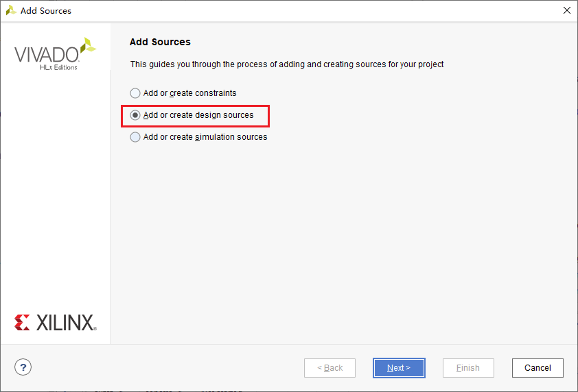

点击next，选择Create File。在弹出的窗口中选择SystemVerilog，名称任意。

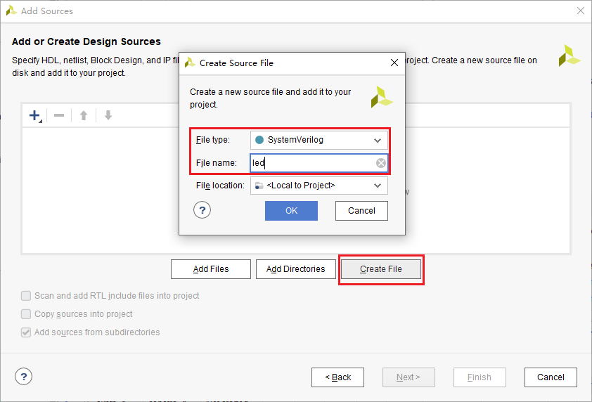

点击Finish。在弹出的Define Module中创建一个名为clk的input信号和名为led的output信号。点击Ok。

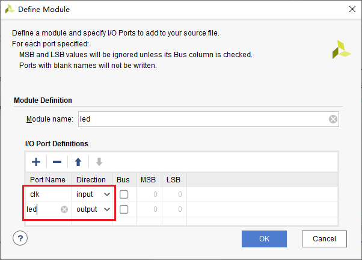

在Design Source下多出一个文件(*.sv)，sv代表SystemVerilog。点击它。

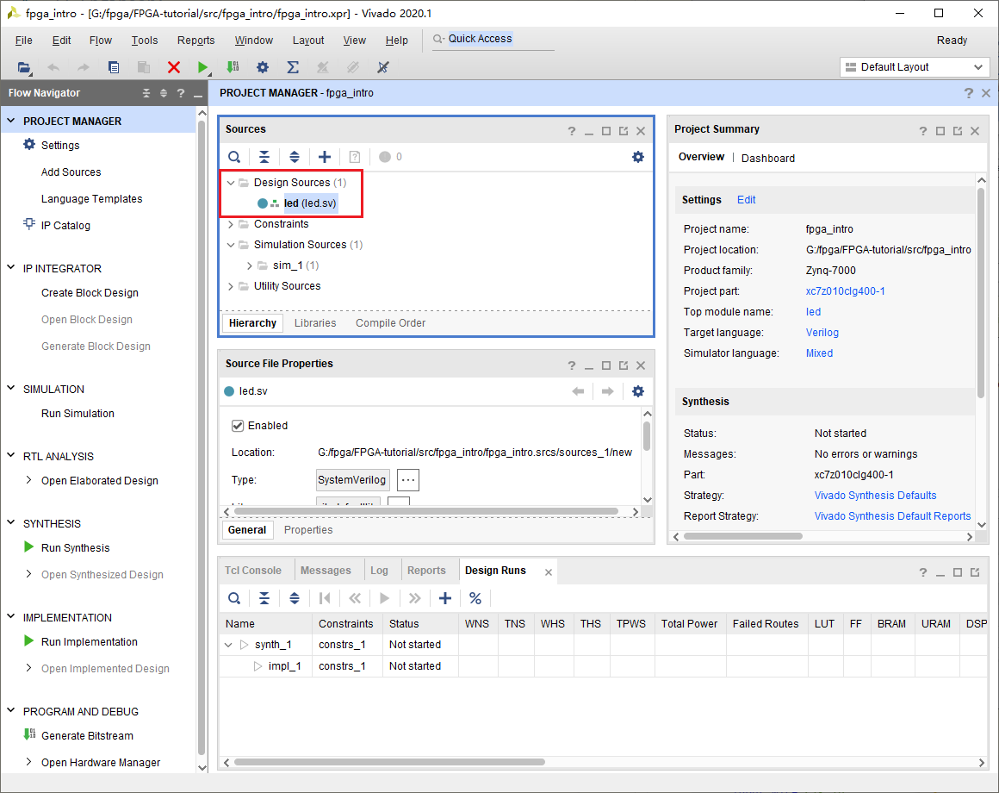

我们发现里面会有一大堆注释和这段语句。这段语句定义了这个Module的输入输出。而在module与endmodule中间，是我们描述整个硬件行为的部分。我们之前定义了两个信号，led毫无疑问会连接到开发板上LED，并控制LED的闪烁。而clk是输入信号，这是做什么的呢？clk是clock的简写，代表时钟。时钟是数字电路的“心脏”。在每个时钟周期内，数字电路都会完成一次运算。CPU中的主频，实际上就是说的时钟信号的频率。
```verilog
module led(
    input clk,
    output led
    );
endmodule
```

我们修改代码如下，并保存。
```verilog
module led(
    input clk,
    output logic led
    );
    always_ff@(posedge clk)begin
        led <= ~led;
    end
endmodule
```

这段代码描述了什么样的电路呢？我们可以通过RTL Analysis来查看结果。点击Open Elaborated Design。右侧就是我们的RTL设计。RTL_REG会在clk的上升沿，将D的数据输入到Q。这个由
`always_ff@(posedge clk)`描述。而RTL_INV负责将Q的数据取反然后输入到D，取反意味着1会变成0，vice versa。这意味着在每一个时钟上升沿，led的值都会变化，产生LED闪烁的效果。

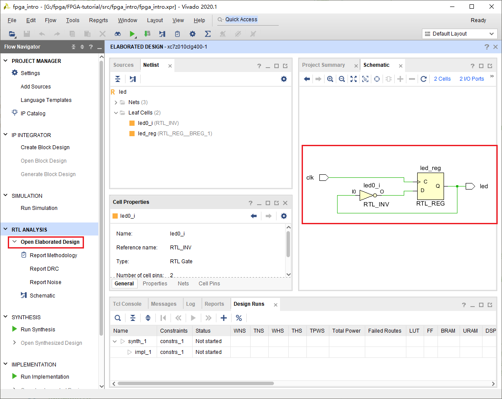

## 综合
点击左侧的Run Synthesis，在弹出的窗口点击Ok。等待综合完成

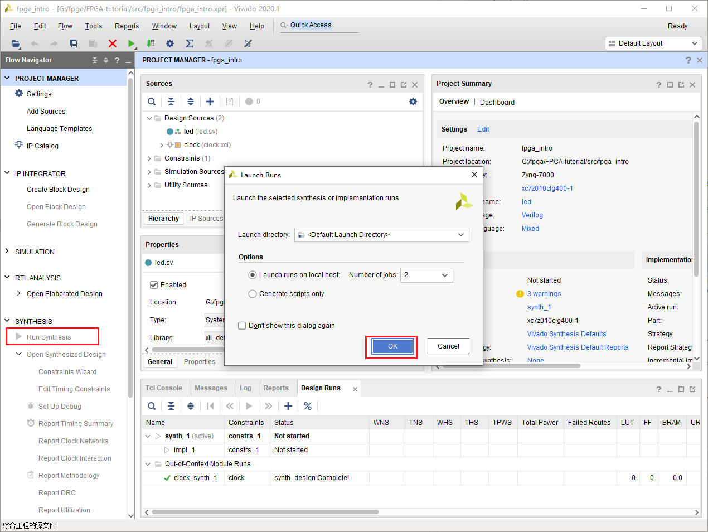

选择Open Synthesized Design，点击OK。或者在左边点击Open Synthesized Design。

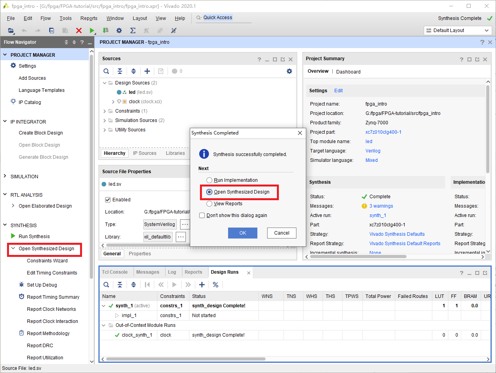

我们此时就可以看到电路被综合以后的结果。BUF是为了隔离其他电路对这部分电路的影响，包括提高驱动能力，降低延迟等。FDRE表明这首先是一个D触发器，接着它是同步使能，同步复位。FDRE的D与Q代表数据的输入与输出。C表示时钟信号。这与我们在上一个电路图中看到的是一致的。多出来的CE代表时钟使能，R表示复位。它们永远保持在一个状态，与我们的电路无关，所以不会出现在上一幅图中。但是如果要实现出来确实必要的。上一幅图中的反相器被一个叫LUT的替换了，LUT是查找表的意思，是FPGA实现组合逻辑的一种方式。

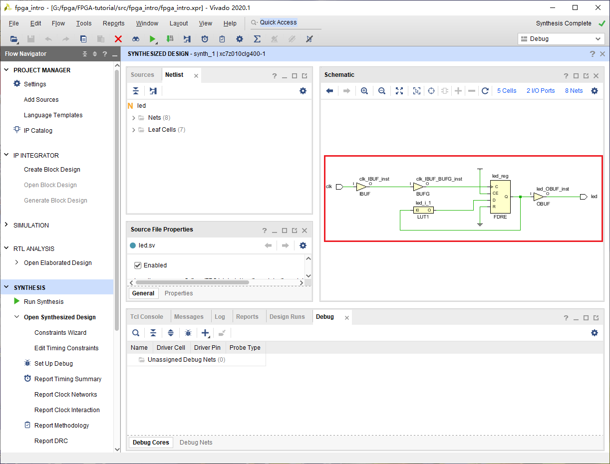

可见综合后的电路是可以被真正实现的，因此包含了更多的细节。这些细节是与我们电路功能不太相关的，因此可以在设计的时候被忽略的。

## 实现
点击左侧的Run Implementation，在弹出的窗口点击Ok。等待实现完成

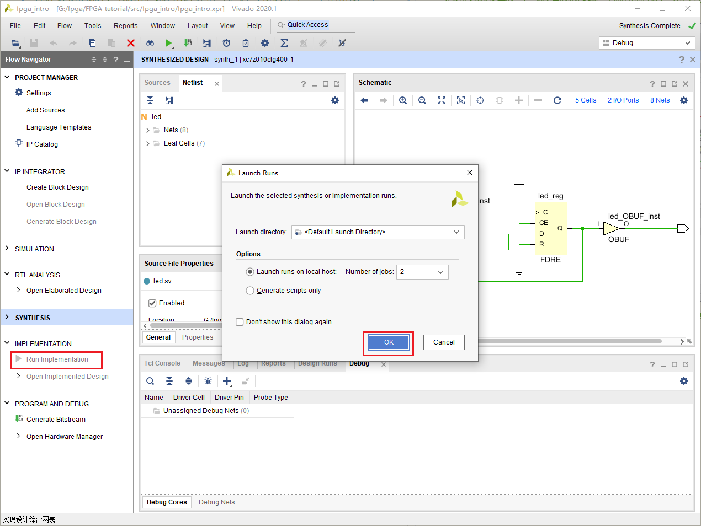

和之前一样打开Implemented Design，就可以看到这个程序真正在FPGA上实现的结果了。选择Leaf Cell下面的LUT，点击工具栏里的Routing Resources，然后放大到那个位置。这就是我们整个程序主体的实现结果。可以看见图中选中的即为synthesized design中的LUT，而另一个蓝色方块为FDRE。绿色代表它们之间的连线。

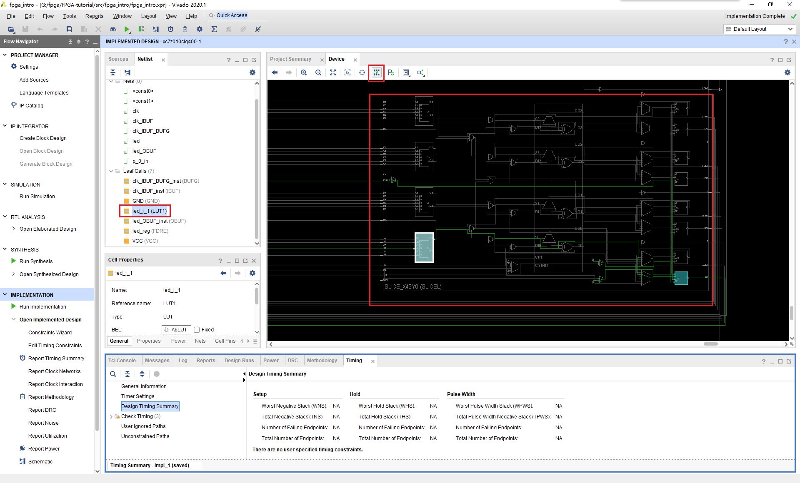

## 生成bitstream与下载
这时候我们就已经到了整个的设计流程的最后一步，下载程序。和之前一样点击Generate Bitstream，然后点击Ok。我们马上就见到了报错。生成失败了！这是为什么呢？

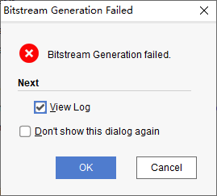

查看Log与Message，我们发现了几条重要线索。

Message(Error):
> [DRC NSTD-1] **Unspecified I/O Standard**: 2 out of 2 logical ports use I/O standard (IOSTANDARD) value 'DEFAULT', instead of a user assigned specific value. This may cause I/O contention or incompatibility with the board power or connectivity affecting performance, signal integrity or in extreme cases cause damage to the device or the components to which it is connected. To correct this violation, specify all I/O standards. This design will fail to generate a bitstream unless all logical ports have a user specified I/O standard value defined. To allow bitstream creation with unspecified I/O standard values (not recommended), use this command: set_property SEVERITY {Warning} [get_drc_checks NSTD-1].  NOTE: When using the Vivado Runs infrastructure (e.g. launch_runs Tcl command), add this command to a .tcl file and add that file as a pre-hook for write_bitstream step for the implementation run. Problem ports: **clk**, and **led**.

这是什么意思呢？我们看不懂，然而抓取关键字我们知道这是和I/O有关系，而且这个报错是关于clk和led这两个信号的。继续debug，我们发现还有几个warning。

massage(warning):
>[Constraints 18-5210] **No constraints selected for write.** Resolution: This message can indicate that there are no constraints for the design, or it can indicate that the used_in flags are set such that the constraints are ignored. This later case is used when running synth_design to not write synthesis constraints to the resulting checkpoint. Instead, project constraints are read when the synthesized design is opened.

原来这个错误可能和没有约束文件有关系。约束文件是干什么的呢？HDL只能描述FPGA内的电路的行为，对于其它则没有能力去描述。比如我希望某个信号是连接到外部IO口，比如我希望某一段电路的延迟小于某个数值。这时候就需要约束文件去描述了。

重新打开Synthesized Design。点击I/O Pins，随后修改Package Pin与I/O std。这对于每个开发板都是不一样的，这需要查找原理图才能知道。注意如果是Zynq，时钟信号要连接到PL端的时钟。

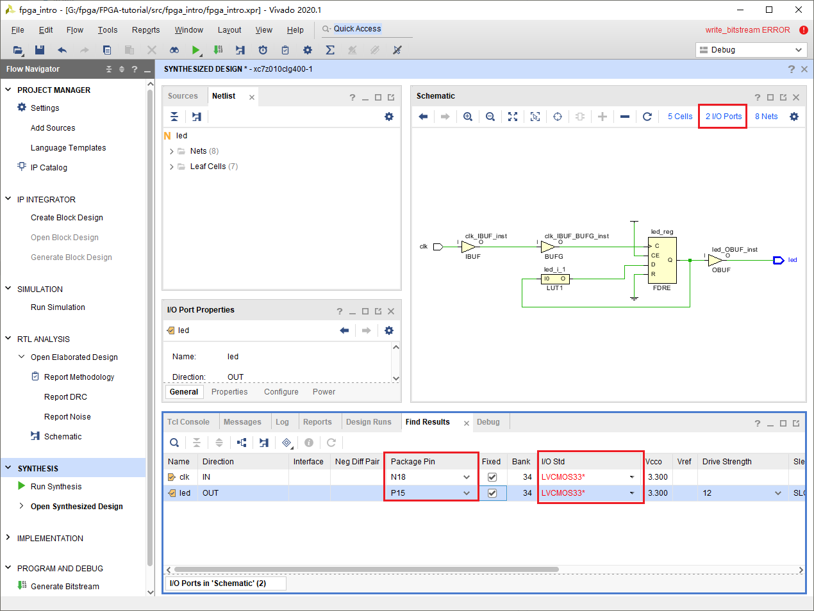

Ctrl+s保存，在弹出的窗口修改名称，点击OK。

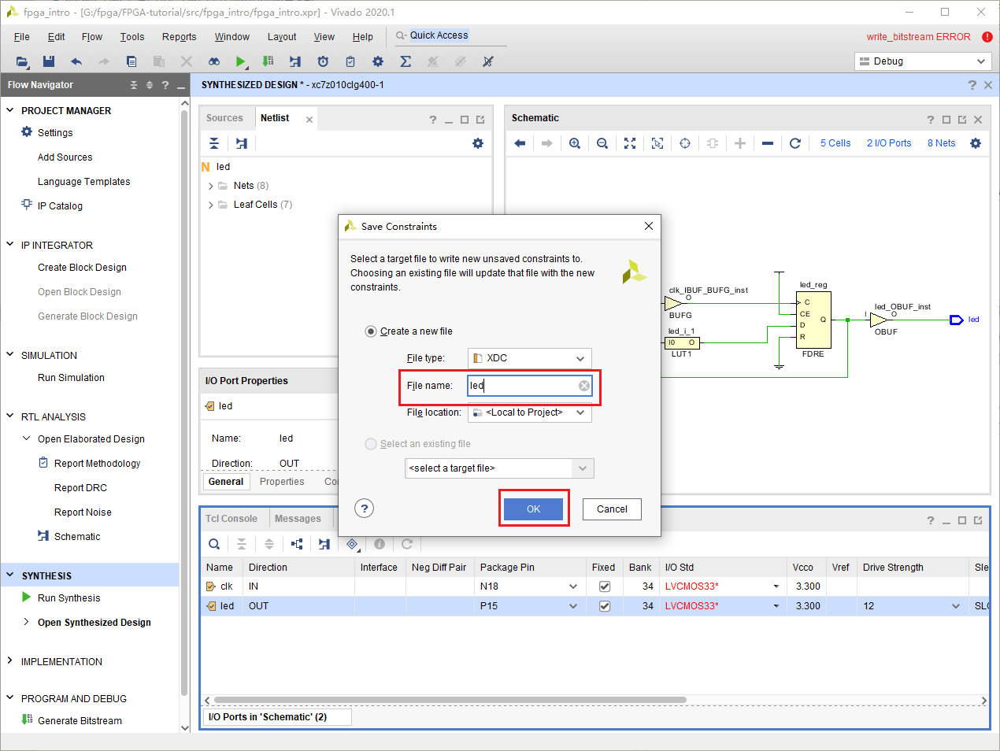

我们可以发现，在Sources窗口下的Constraints里面多了一个*.xdc的文件。它的内容正好对应我们修改的内容。

```
set_property IOSTANDARD LVCMOS33 [get_ports clk]
set_property IOSTANDARD LVCMOS33 [get_ports led]
set_property PACKAGE_PIN N18 [get_ports clk]
set_property PACKAGE_PIN P15 [get_ports led]
```

此时就可以重新点击Generate Bitstream。等待重新综合和实现完成。这个时候插入你的开发板，然后选择Open Hardware Manager，点击Ok。

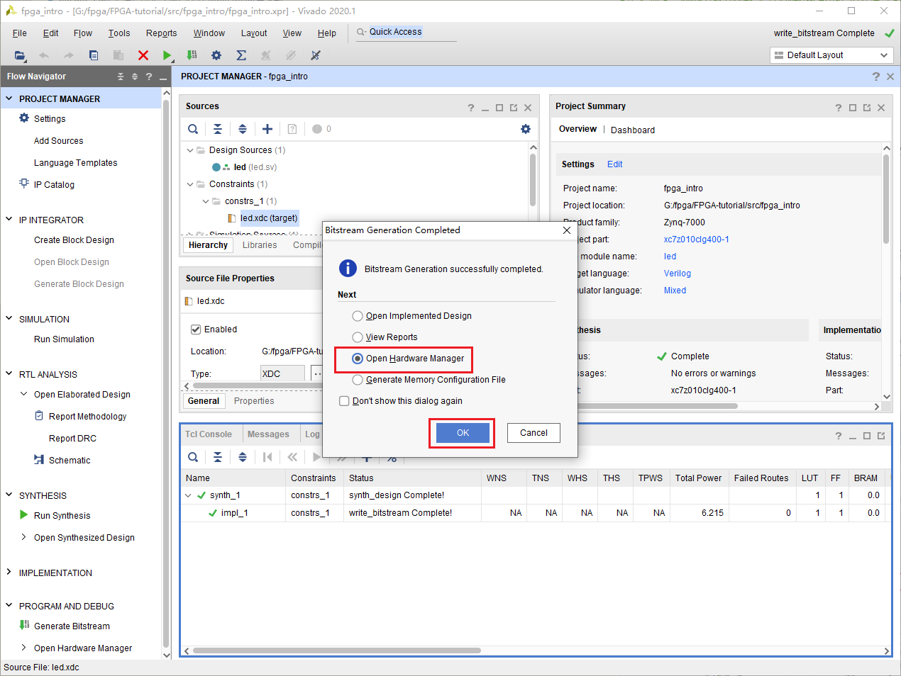

选择Open Target，然后选择Auto Connect。此时应该会连接上你的设备。


然后选择Program Device，在弹出的窗口里选择Program。就可以下载了。

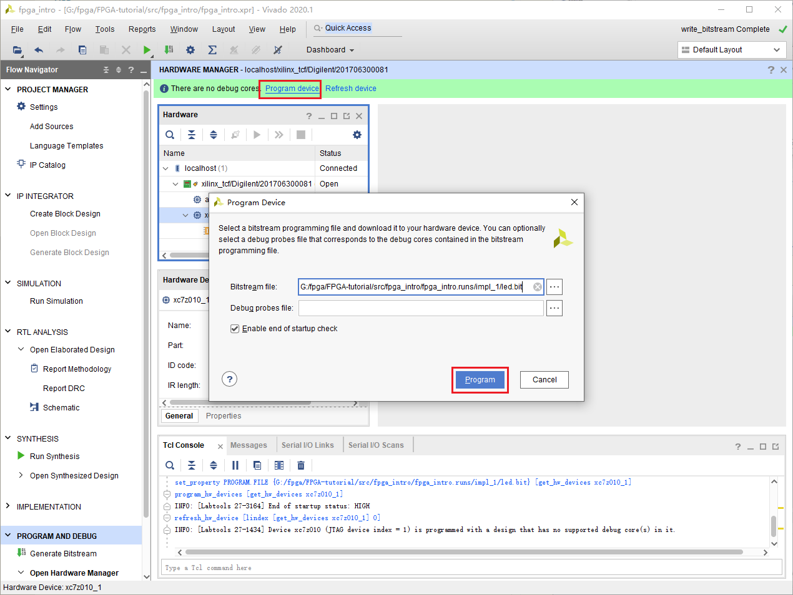

这时候如果一切正常，你会发现LED一直发光。什！为什么不是闪烁？问题出在哪里？