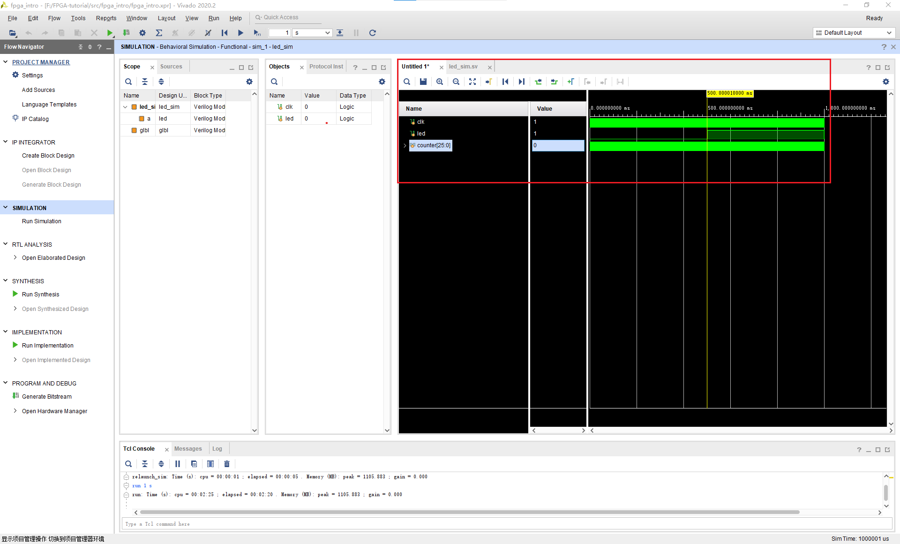
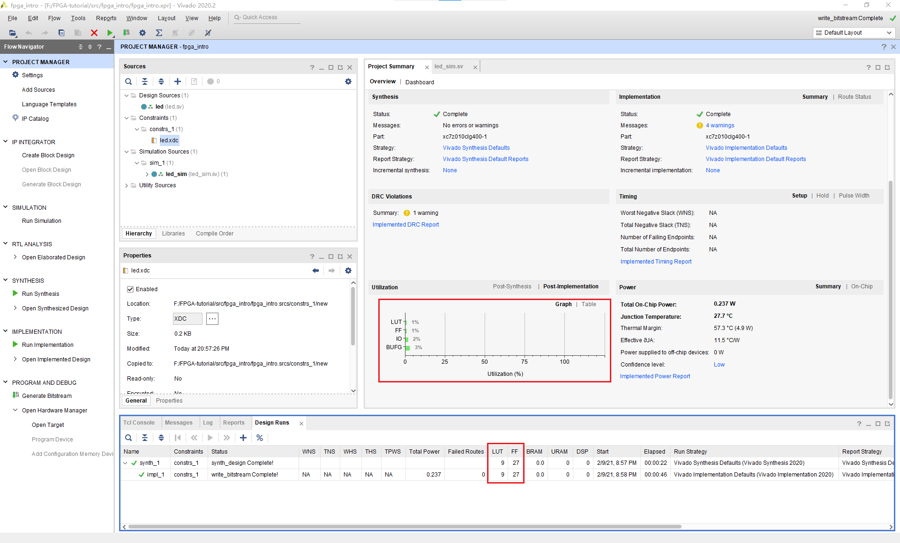
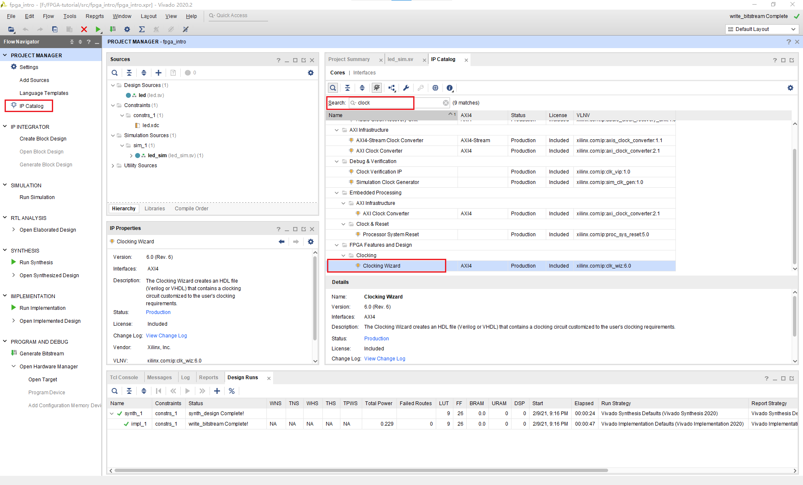
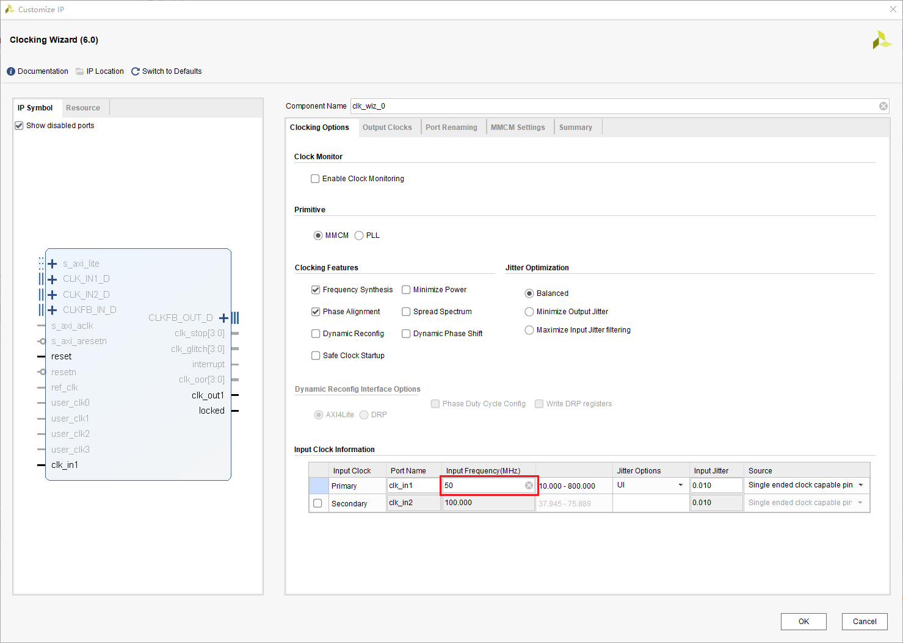
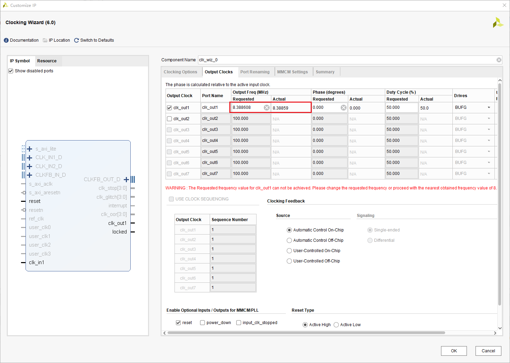
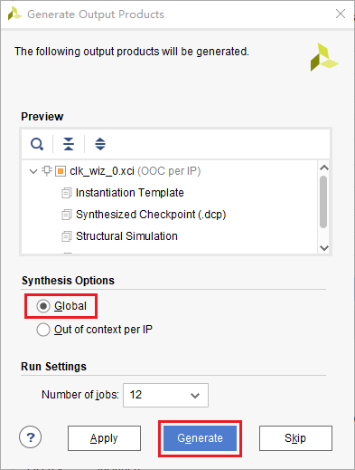
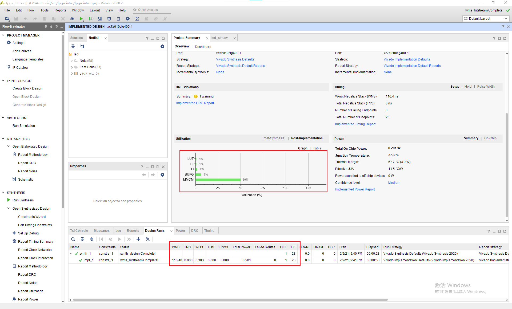

# 为什么灯不闪烁？

为什么仿真结果是正确的，但是下载到板上却是错误的？ 注意到verilog文件中有一个语句我们一直没有讲述它的具体含义。

```verilog
`timescale 1ns / 1ps
```

这句话代表着仿真时间单位与精度，这里代表我们以1ns的时间单位仿真，仿真精度为1ps。而我们在激励文件中是这样写的

```verilog
forever #(10) clk = ~clk;
```

这意味我们的时钟信号的半周期为10ns，频率也就是50MHz，这与我们开发板的时钟信号是一致的。这就意味着我们的LED每秒会闪烁25M次。我们希望这个灯能闪烁的慢一点，最好它周期是可控的，比如我希望这个灯的周期是1s。

如果你了解过单片机，你会发现在单片机中类似的功能是由计数器提供的。这个计数器的原理顾名思义就是累计时钟信号的次数，当到达一定次数的时候也就意味着过了多长时间了。

在FPGA中，我们也可以通过实现一个计数器来达到类似的目的。比如时钟信号是50MHz的，那我们要做三件事情
1. 累计时钟信号经过的周期数
2. 当累计25M次，清零
3. 当周期数=25MHz，也就是经过了0.5s时，改变LED的状态

将代码修改为

```verilog
`timescale 1ns / 1ps

module led(
    input clk,
    output logic led=0
    );

    logic [24:0] counter=0;
    //累积周期数，并清零
    always_ff@(posedge clk)begin
        if(counter==25000000)
            counter<=0;
        else
            counter<=counter+1;
    end
    
    //判断是否改变LED
    always_ff@(posedge clk)
        if(counter==25000000)
            led<=~led;

endmodule
```

接着我们进行仿真。将counter信号添加到波形中，进行仿真，结果如下。我们注意到在0.5s的时候计数器到了25M次，于是就清零了。同时led的状态也被改变了。而在1s的时候，counter的又记到了25M次，于是又清零了。而同时led的状态也再次被改变。



我们下载到开发板，果然一切正常了。

# 优化
在编写完这样一个简单的程序，一个问题是，是否有优化的空间？和编写软件一样，实现一个功能有多种方法，我们需要对多个设计参数进行考量，找到一种最合理的方法。

为了查看这个设计综合实现的结果，我们打开Project Summary，这里可以看到所有的结果。

我们发现这个设计**竟然**使用了9个LUT和26个FF。虽然我们总共有17600个LUT和35200个FF，我们希望占用更少的LUT和FF，那要如何实现呢。


## 定位优化空间
我们注意到这个设计中最大的开销就是26位宽的counter和它的比较器，如果我们能想办法缩减counter的位数，就可以减少LUT和FF使用的数量。

而如果要存储25M，我们必须要使用26位宽的寄存器。虽然\\( 2^{25}\approx 35M \\)，但我们无法再减小位宽了，因为\\( 2^{24}\approx 16M <25M \\)。

但是归根到底，我们需要25M还是因为时钟信号的周期为50MHz。如果我们有一个2的整数倍频率的周期信号，也就不需要这么麻烦了。事实上，FPGA中内置的锁相环可以解决这个问题，它可以将我们的时钟信号通过某种玄学变为4.687MHz~800MHz中的任意一个频率。由于锁相环是模拟电路实现的，直接在FPGA内就有，不需要占用FF和LUT，这样就可以减少FF和LUT的占用了。

## 生成Clock IP
点击IP Catalog，搜索clock，并找到Clock Wizard，双击。



将输入的时钟频率改为你开发板的时钟频率，一般为50MHz。



将输出的时钟频率改为8.388608MHz，这个数字正好是\\( 2^{23} \\)。



点击OK，将Synthesis Options改为Global，并点击Generate。



最后将led.sv改为

```verilog
module led(
    input clk,
    output led
    );
    logic clk_div,locked;

    //连接clk_wiz_0ip与led模块
    clk_wiz_0 c(
        .clk_out1(clk_div),
        .locked(locked),
        .clk_in1(clk)
    );

    //计数器，由于计数器在8388608+1时溢出了，所以就变成0了
    logic [22:0] cache=0;
    always_ff@(posedge clk_div)
        if(locked)
            cache <= cache + 1'b1;

    assign led=cache[22];
endmodule
```

## 结果
可以看到我们只用了1个LUT与23个FF。这是因为加法运算由快速进位链完成了。而由于我们不需要比较器，所以大幅减少了LUT与FF的数量。但是我们发现时序出现了一些问题，这是由于23位的加法需要6个4位的快速进位链，这延长了最长路径，加大了延迟。所以尽管我们减少了LUT和FF的数量，却加大了最大延迟，降低了时钟的速度。

