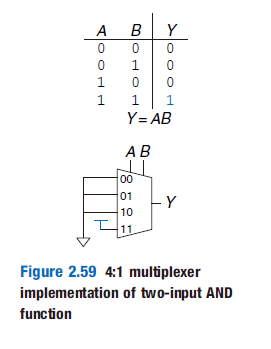
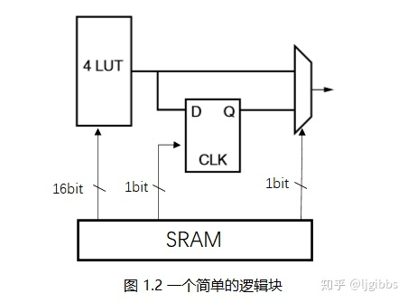
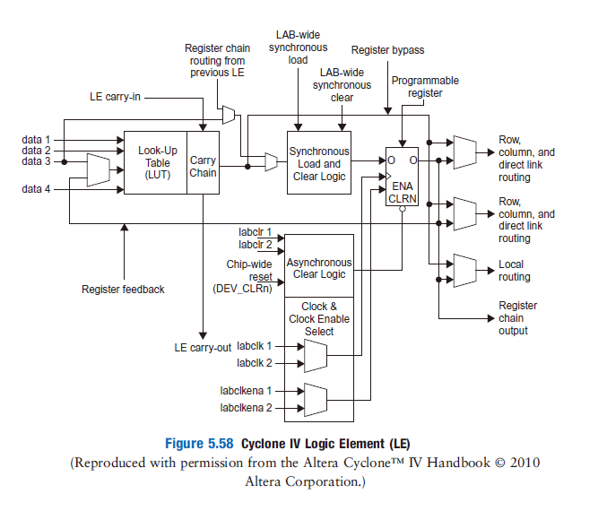
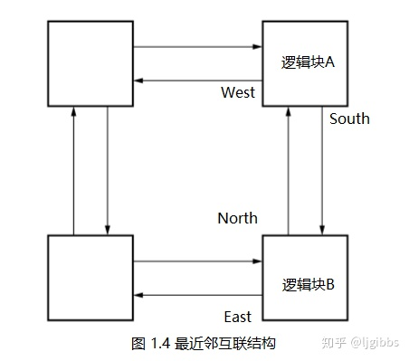
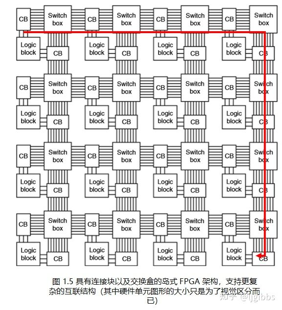
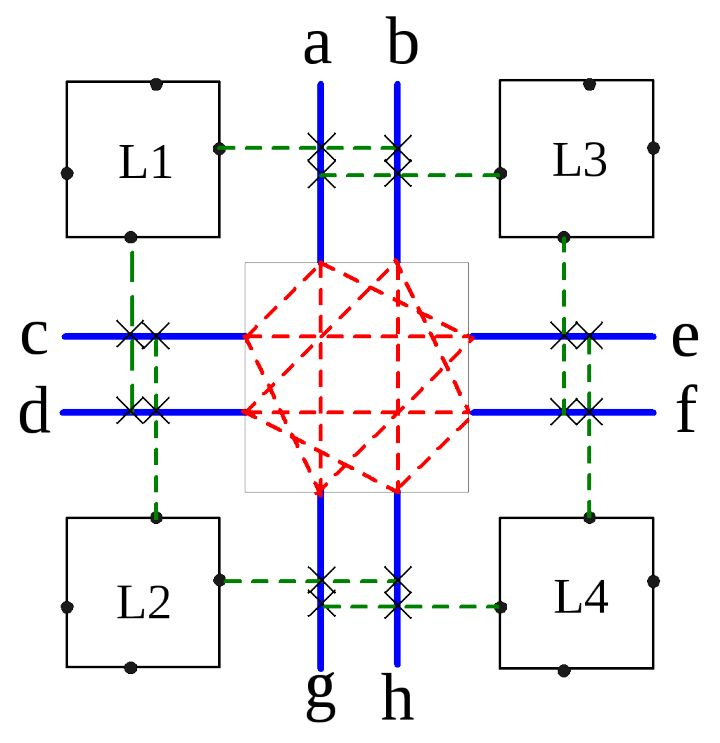
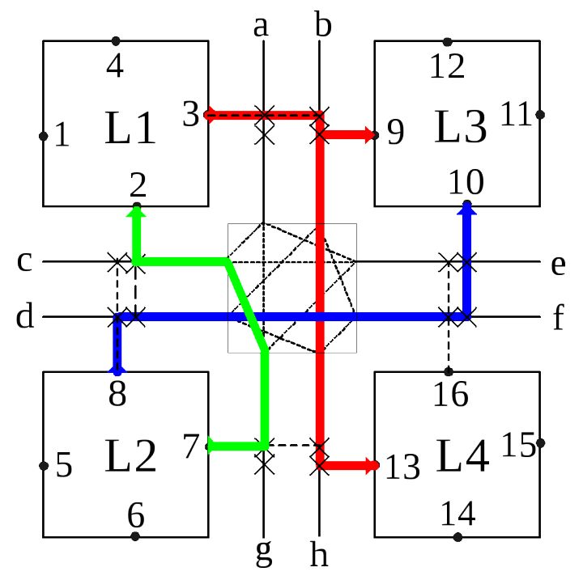
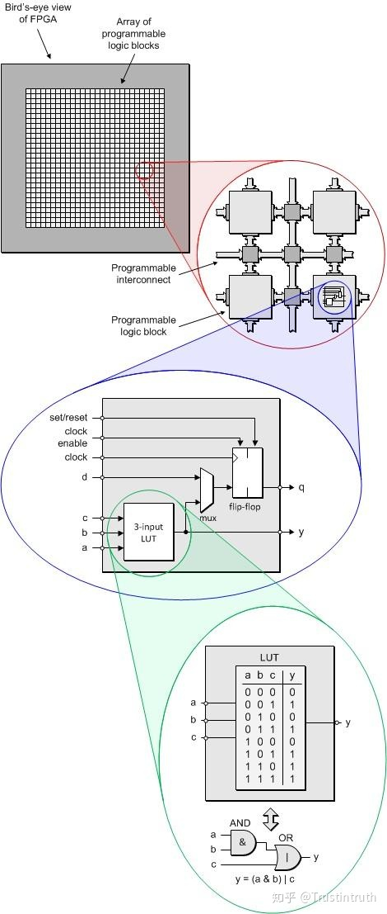

# FPGA内部组成

在序章中，我们提及了FPGA以更大的芯片面积和更低的运算速度换取了ASIC没有的可编程性，同时相对于基于冯诺依曼体系的可编程性有着更高的灵活性，在一些专用的场合得以获得更高的性能。

那么，FPGA是如何实现这个的呢？这得从FPGA内部的结构说起，FPGA包含了三种基本单元，可编程逻辑单元（**C**onfigurable **L**ogic **B**locks）或称逻辑块（**L**ogic **B**lock）、互联结构（Interconnect Structures）与IO单元（**I**nput/**O**utput **E**lements）。

其中IO单元主要实现的是与芯片外部的连接，这里就不赘述了。我们主要关注逻辑块与互联结构。

## 逻辑块

逻辑块是**模拟**组合逻辑与时序逻辑的基本单元。这里我们使用模拟而不是实现表明逻辑块在被配置后并没有真正变成数字电路，而是通过某种方式实现了同样的功能。这种方式就是查找表（**L**ook-**U**p **T**able）。

### 查找表

我们在Verilog-电路建模这一节讲述：？操作符时顺便介绍了选择器与它的电路实现。查找表的本质就是一个选择器。只不过选择器的输入信号不是固定的，而查找表是的。以下是通过查找表模拟的与门。

可以发现我们将4：1选择器的三个输入都拉低，而一个输出拉高。当AB分别输入11时，这时候选择器选择的是11，也就是高电平。而当AB输入其他时，选择器输出的为低电平。这恰好和与门的真值表一样，也就是说，我们模拟了与门的功能。

这好像是不合算的，因为你用了几个逻辑门来实现一个逻辑门的功能。然而当一个真值表很难用逻辑门来实现，或者我们这种情况，需要可配置性。可是这样还是没有实现可配置性啊？实际上很显然，我们只需要配置选择器输入信号的值就可以决定这个查找表的值。通常可以将查找表连接到一个储存器上，就可以了。

> 目前基于大量基准电路（benchmark circuits）的经验表明，4-LUT 结构在面积和延迟之间取得了最佳的平衡。当然，随着 FPGA 计算包括更多的应用领域，这个研究结果可能需要重新审视。事实上，在撰写本文时，Xilinx 已经发布了 Virtex-5 FPGA，采用 6-LUT 架构  
> 《可重构计算：基于FPGA可重构计算的理论与实践》

然而查找表只能实现组合逻辑电路，我们知道FPGA还能实现时序逻辑的功能，这通常需要一个触发器。而实际上，这也非常简单，只需要通过一个选择器选择输出为直接输出查找表结果或者输出经过一个触发器的值。所以一个简略的逻辑块结构如下。

现实中，通过这种方式模拟是低效的。通常，对于一些被大量使用的电路，如加法电路，ROM等。FPGA都会直接内置完整的电路，而不是通过查找表的方式实现。一个商用的逻辑块如下

## 互联结构

我们已经实现了模拟数字电路的功能，然而值得注意的是，尽管FPGA的主要功能实现依赖于逻辑块，在一个FPGA上，占面积最大的电路是互联结构。互联结构，顾名思义，就是将这些逻辑块连接在一起的结构。

这是一个最简单的互联结构。然而正因为非常简单，有着致命的缺陷。当一个逻辑块想和非相邻的逻辑块连接时，延迟随着距离线性的增长。而延迟，是制约时序逻辑电路运算速度的一大原因。

> 由于这些局限性，最近邻结构很少单独使用，但它几乎总是存在于当前的 FPGA 结构中，并通常会与以下一些技术共同使用，以改善近邻结构的局限性。  
> 《可重构计算：基于FPGA可重构计算的理论与实践》

因此现在FPGA都是设计成岛式，也就是说，每个逻辑块像一个孤岛一样，漂浮在由连接块（**C**onnect **B**lock）与交换盒（Switch box）组成的海洋上。

连接块负责决定逻辑块如何连接到总线上，而交换盒则负责决定总线之间如何连接。一个简单的2*2结构如下。图中绿色为连接块，红色则是交换盒。

如果想将这四个逻辑块连接在一起，只需要控制连接块与交换盒就可以了。

## 总结

