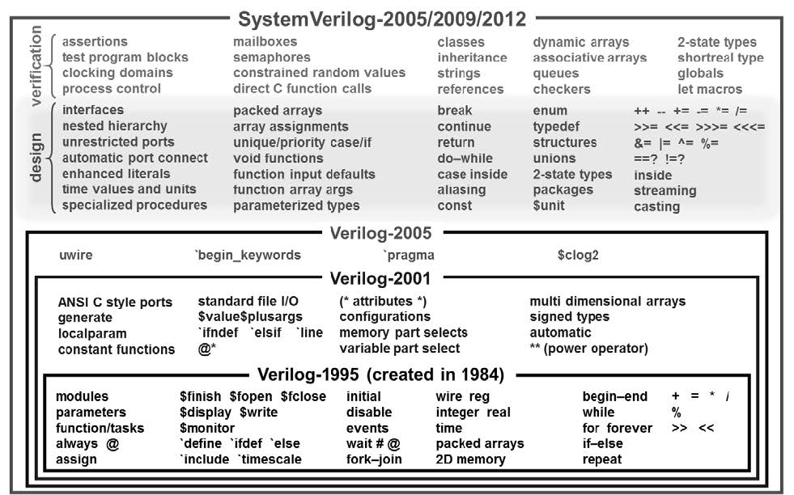

# 可综合的SystemVerilog
## SystemVerilog不只是为验证而生

> 翻译自'Synthesizing SystemVerilog
Busting the Myth that SystemVerilog is only for Verification'  
> 作者为 Stuart Sutherland与Don Mills

## 摘要
SystemVerilog不只是为验证而生！当SystemVerilog的标准被制定时，一个主要的目标就是能用更少的代码去更精确的创建可综合的模型用于描述复杂的硬件设计。这个目标最终实现了！Synopsys花了大力气在Design Compiler和Synplify-Pro中实现SystemVerilog。本篇论文详细的讨论了SystemVerilog可综合的子集，并展示了这相对于verilog的优势。读者可从中学会如何使用更少的代码去构建RTL模型，同时减少潜在的设计错误、获得好的synthesis Quality of Results(QoR)。

## 前言——Verilog vs SystemVerilog的谬论
人们通常认为**Verilog** 是一个**可以综合的硬件描述语言**，而**SystemVerilog** 是一个**不可综合的验证语言**。

**这是完全错误的！**

Verilog是一个可以用于描述硬件和构建Testbench的语言，最先在1984年被提出。许多Verilog的组成部分，如`if..else`，被设计为既可以被用于硬件建模，也可以用于验证。一部分则被设计为仅可以用于验证，比如`$display`。它们不能被综合为硬件。综合只和Verilog有关硬件建模的部分有关，因此只支持Verilog的一个子集。

IEEE在1995年提出了1364-1995——Verilog语言的标准，又被称为Verilog-1995。随后IEEE在2001发布了1364-2001标准，扩展了Verilog硬件建模与验证的功能。通常这被称为Verilog-2001。翌年，IEEE发布了1364.1-2002 Verilog RTL Synthesis，规定了Verilog-2001的一个可综合的子集。

IEEE也更新了Verilog的标准，发布了1364-2005，又被称为Verilog-2005。然而，随着集成电路的功能、复杂度与时钟的速度在21世纪飞速的增长。一点点的更新Verilog已经无法满足日益增长的需求。于是，IEEE提出的新的特性多到不得不为它们创建一个新的标准1800-2005，又被称为SystemVerilog。SystemVerilog-2005不是一个独立的语言，它是Verilog-2005的超集。（类似c与c++的关系）之所以提供两个文档只是为了帮助EDA公司集中精力实现新的特性。

**随后的事情令人费解**。在2009年，IEEE把Verilog 1364-2005标准和SystemVerilog 1800-2005标准合并进一个文档。令作者不解的是，IEEE选择舍弃原有Verilog的命名，并把新标准的名称改为SystemVerilog。原来的1364 Verilog标准再也没有了，IEEE批准1800-2009 SystemVerilog-2009成为一个完整的硬件建模与验证语言。在IEEE的命名系统中，再也没有一个Verilog的标准，取代它的是SystemVerilog标准。自**从2009年，你就没有再真正使用过Verilog。你一直在使用SystemVerilog进行设计与综合！** （IEEE随后发布了SystemVerilog-2012标准，为已故的Verilog添加了更多功能）

值得注意的是，SystemVerilog同时扩展了Verilog硬件建模与验证的能力。下图展示了几个SystemVerilog对于原有Verilog的扩展。本文主要聚焦这部分语法是如何被综合的，并相对于Verilog有何优势。

另一个有趣的是，IEEE没有发布SystemVerilog可综合子集的标准。IEEE没有选择更新1364.1 Verilog synthesis标准。作者认为这是短视的表现，同时失职于工程师群体。不过，作者希望本篇文章，作为1364.1 Verilog synthesis补充，可以充当SystemVerilog可综合子集的一个非官方的标准。