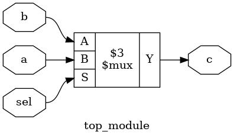

# verilog语法基础
在这一节中，我们将学习verilog的一些基础知识，随后才开始真正进入verilog的学习。

## 注释
verilog的注释方式与C完全一致。

```verilog
//这是一个注释
```

```verilog
/*这个注释从这里开始
阿巴阿巴
这个注释在这里结束*/
```

## 数字常量的表示方式

数字常量在逻辑电路有着很重要的意义，比如一个计数器需要在每一个上升沿加一，此时的做法就是将一个拉高电平（代表1）的导线和计数器的寄存器用加法器连接在一起，并接一个触发器。

在编程中，常量储存在常量池中，与变量的存储方式基本一致。而在数字电路中，常量往往是用拉高电平（代表1）或拉低电平（代表0）来实现的。

在Verilog中，数字常量关注三个量，位宽，基数与数字本身。比如十进制下三位宽的2，可以如下表示

```verilog
3'b010
3'o2
3'd2
3'h2
```

可以发现先是位宽，然后是基数，基数可选的有二进制（d），八进制（o），十进制（d），十六进制（h），最后是对应基数下的数字。值得注意的是这里的位宽都是指二进制下的位宽。

```
[size]'[base][number]
```

当然如果可以由编译器直接推断位宽，此时可以忽略位宽。这种做法极为不推荐，仅在少数情况中使用，比如给一个向量初始化为全0。

```verilog
reg [3:0] a; //一个四位宽的向量a
assign a= 'b0; //这个等价为4`b0000
```

甚至当你不关注于基数时，可以直接忽略，写成纯数字，此时采用的是十进制。

```verilog
2 
```

## 数据类型
由于Verilog原来是用来仿真而不是描述硬件的，出于仿真的需求，数据类型总体分为net和variable两大类。

net类用于表示导线结构，它不存储状态，只能负责传递驱动级的输出。常见的net类数据包括wire、tri、wand和supply0等。variable类设计用于表示存储结构，它内部存储状态。reg是最典型的variable类数据。

| net | variable |
|-| -|
| wire, tri ... | reg, integer ... |

最常用的两种类型是wire与reg。reg和编程语言中的变量是类似的，可以理解为开辟了一块区域用于存储数据。wire则不同，它表示数据的传递方向。在一个模块中，当数据从多个input流入，如何从output流出的过程可以用wire来描述。 

但要注意的是wire与reg有可能不直接对应底层的电路，比如使用了reg，最后生成的电路中却是组合逻辑电路。也就是不包含任何状态储存元件的电路。

```verilog
module top_module(
	input reg a,b,sel, //这里声明了四个reg变量
	output reg c);

always@(*)
	if (sel) c=a;
	else c=b;

endmodule
```
这个代码生成的电路是一个选择器，在之后的学习中，我们可以用纯粹组合逻辑的方式实现一个选择器。

 

为了解决这个问题，SystemVerilog引入了logic的概念，编译器会自行推断是wire还是reg。在大部分情况下，使用logic可以替代wire与reg，除了多驱动电路。所以上述代码可以改成。

```verilog
module top_module(input logic a,b,sel,output logic c);
always@(*)
	if (sel) c=a;
	else c=b;
endmodule
```

### 变量可以储存哪些值
|值|含义|
|-|-|
| 0 | 表示逻辑上的否 |
| 1 | 表示逻辑上的是 |
| x | 表示一个未知的量（通常是一种错误）|
| z | 表示高阻态（此时状态由其他驱动决定）|

通常来说，0与1是我们最常用的，如果你需要多驱动电路，会用到Z。但是，一旦出现X，非常可能是一种错误，比如未初始化的寄存器。