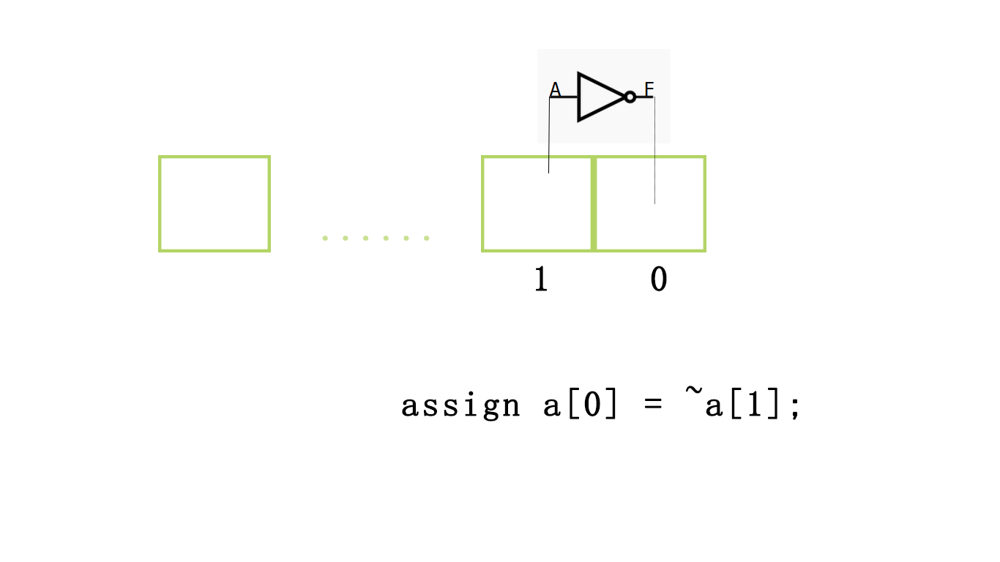
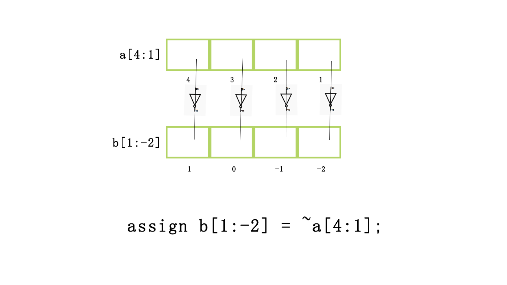
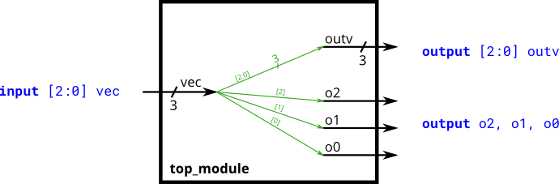
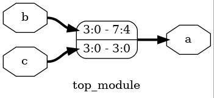
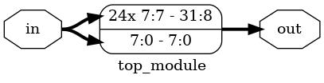
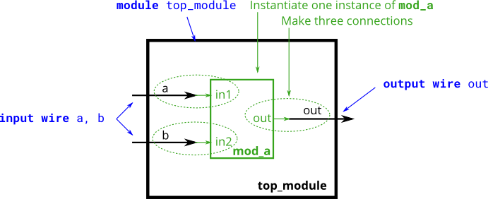

# verilog层级构建
在学习了上节内容，我们终于有了能力编写简单的一位全加器。可是，现实世界中涉及的问题往往并不只有一位，在c++中int的长度是32位。如果没有简单的描述方法，仅仅是实现一个常用的int加法，我们就需要重复编写32个加法器，而这需要声明32*5个不同名称的变量，即使它们的区别仅仅是名字不同。

尽管Verilog的语法并不优美，但它仍然提供了这种情况下简化代码的方式。和C一样，Verilog引入了数组和模块的概念来解决这个问题。向量提供了表示多位输入的方式，而模块提供了多层次的抽象。

这一节中我们将介绍Vector与Module这两个东西解决上述问题。
## vector
Verilog中定义向量的方式与C有很大的区别，以下面为例 

```verilog
wire[9:0] a;
```

这是一个10位，类型为wire的数组。在Verilog中，我们统一采用大数在前的索引方式，我们称之为大端索引，与之相对的还有小端索引。之所以需要标注上下限是因为Verilog允许如下的写法

```verilog
wire[4:1] a;
input wire[1:-2] b;
```

在之后我们会介绍这种写法的好处。

### 索引方式

与C相同的是，Verilog支持单个数字索引。

```verilog
assign a[0] = ~a[1];
```



当然，更常用的方式是对数组整体的索引。

```verilog
assign b[1:-2] = ~a[4:1];
```



如果数组的长度相同，你可以直接忽略索引，当作一个整体操作。

```verilog
assign b=~a;
```

数组的内容当然不止这些，在掌握了基础内容，我们可以练习一下了。

> 例 https://hdlbits.01xz.net/wiki/Vector0  
>   

题目要求将3位的输入分成相同的两部分，一部分全部给outv，而另一部分分给不同的三个输出o2，o1，o0。图中线上的数字标记了这个线的位宽，而带括号的指明了数组的位数。

```verilog
module top_module ( 
    input wire [2:0] vec,
    output wire [2:0] outv,
    output wire o2,
    output wire o1,
    output wire o0  ); // Module body starts after module declaration
    
    assign outv = vec;
    assign o2 = vec[2];
    assign o1 = vec[1];
    assign o0 = vec[0];

endmodule
```

对于数组来说，一个可能的问题是，如果你将不同长度的数组相互连接在一起，会发生什么呢？按照常理来说，这是不被允许的，因为硬件要求容错率远低于软件，相应的编程也因更加严格。然而Verilog中会自动的截尾或转换。在我看来这并非是一个语法糖，而是一个设计上的失误，所以我们应尽量避免这种情况的发生。

> 练习  
> https://hdlbits.01xz.net/wiki/Vector1  
> https://hdlbits.01xz.net/wiki/Vector2  
> https://hdlbits.01xz.net/wiki/Vectorgates  
> https://hdlbits.01xz.net/wiki/Gates4  

### 数组的连接 
数组的索引是选择数组的一部分，而有时候我们希望将多个数组合并成为一个更宽的数组。一个可能的操作方式如下

```verilog
wire[7:0] a;
wire[3:0] b;
wire[3:0] c;

assign a[7:4] = b[3:0];
assign a[3:0] = c[3:0];
```

>   

这并不方便，因为我们需要人为的将每个数组对齐。Verilog提供了连接操作符，语法如下

```verilog
a = {b,c};
```

可以发现左边是高位，右边是低位。所以b在左边，c在右边。这与之前我们声明数组的顺序是一致的。

> 练习  
> https://hdlbits.01xz.net/wiki/Vector3  
> https://hdlbits.01xz.net/wiki/Vectorr  

有时候我们还学要将某一数组复制多份，比如为了保留数字的符号，在扩充时需要根据首位来判断填充0还是1。语法如下

```verilog
a = {2{b}};
```
> 例 https://hdlbits.01xz.net/wiki/Vector4  

题目要求根据在扩充数组时，复制第一位。

```verilog
module top_module (
    input [7:0] in,
    output [31:0] out );//

    // assign out = { replicate-sign-bit , the-input };
    assign out = {{24{in[7]}},in};
endmodule
```

>   


> 练习  
> https://hdlbits.01xz.net/wiki/Vector5 

### 逻辑操作符与位操作符  

对于一位的两个变量，逻辑操作符与位操作符没有区别。对于多位的变量，位操作符对各个位进行操作，而逻辑操作符对整体操作（true = 非全0， false = 全0）。

> 例 https://hdlbits.01xz.net/wiki/Vectorgates

```verilog
module top_module( 
    input [2:0] a,
    input [2:0] b,
    output [2:0] out_or_bitwise,
    output out_or_logical,
    output [5:0] out_not
);
    assign out_or_bitwise = a |b;
    assign out_not[2:0] = ~a;
    assign out_not[5:3] = ~b;
    assign out_or_logical = a || b;
    
endmodule
```
## module
模块的声明如下

```verilog
module <name> ([port_list]);
	// Contents of the module
endmodule

// module可以不需要端口
module name;
	// Contents of the module
endmodule
```
以module关键字开始，接着是模块的名称，随后是括号，括号内写明输入输出，以逗号间隔开。如果没有写明类型，默认为wire。

```verilog
module a(input clk) //等价为input wire clk

endmodule
```

对于输入输出一共有三种类型

|类型|描述|
|-|-|
|input|只能出现在等号右端|
|output|只能出现在等号左端|
|inout|都可以|

一个完整的声明如下

```verilog
input [net_type] [range] list_of_names; 
```
如

```verilog
input logic [3:0] a,b,c,
```
## module Instantiations
module的使用方式和类实例化的方式很类似

```verilog
wire a,b,c;
mod_a ins(.in1(a),.in2(b),.out(c));
```

值得注意的是这里我们直接指明了输入输出名称，而不是使用顺序。尽管Verilog允许使用顺序的方式

```verilog
wire a,b,c;
mod_a ins(a,b,c);
```

但是正如上面提及的，硬件的容错率很低，在大项目中如果某一个地方更改了声明的顺序，可能会导致某处连接错误，这种bug通常难以找到。所以直接指明输入输出名称是一个使用模块的好习惯。

> 例 https://hdlbits.01xz.net/wiki/Module  
>   

```verilog
module top_module ( input a, input b, output out );
    mod_a ins(.out(out),.in1(a),.in2(b));
endmodule
``` 

> 练习  
> https://hdlbits.01xz.net/wiki/Module_pos  
> https://hdlbits.01xz.net/wiki/Module_name  
> https://hdlbits.01xz.net/wiki/Module_shift   
> https://hdlbits.01xz.net/wiki/Module_fadd  
> https://hdlbits.01xz.net/wiki/Module_cseladd  
> https://hdlbits.01xz.net/wiki/Module_addsub  

### 例

>例1 将两个16位的加法器连接在一起变成32位的  
>https://hdlbits.01xz.net/wiki/Module_add


```verilog
module top_module(
    input [31:0] a,
    input [31:0] b,
    output [31:0] sum
);
    wire cout;
    add16 ins1(a[15:0],b[15:0],0,sum[15:0],cout);
    add16 ins2(a[31:16],b[31:16],cout,sum[31:16],0);

endmodule
```

>例2 通过电路面积换取运算速度 
>https://hdlbits.01xz.net/wiki/Module_cseladd


```verilog
module top_module(
    input [31:0] a,
    input [31:0] b,
    output [31:0] sum
);
    wire [15:0] sum1,sum2;
    
    add16 ins1(a[31:16],b[31:16],0,sum1,0);
    add16 ins2(a[31:16],b[31:16],1,sum2,0);
    
    wire cout;
    
    add16 ins3(a[15:0],b[15:0],0,sum[15:0],cout);
    
    always_comb begin
        if (cout == 1) begin
            sum[31:16] = sum2;
        end else begin
            sum[31:16] = sum1;
        end
    end
    
endmodule
```

我们都知道电流的传播速度是有限的，因此数字电路的一大问题就是在于一个电路越长时，使这个达到稳定状态即完成它的功能所需的时间就越长。因此，缩短最长路径是优化电路的一个方式。

这里虽然使用了三个16位加法器来计算32位加法，但相对于例1，我们的最长路径缩短了差不多一半，于是也就加快了运算速度。从程序的角度来看，我们的程序本来是这个样子的。

```
//thread1
add16()
add16()
```

现在他变成这个样子了

```
//thread1
add16()
```
```
//thread2
add16()
```
```
//thread3
add16()
```

即使我们需要舍弃一个的运算结果，每个线程的运算所需时间都是上一个程序的一般，而当他们同时运行，总共所需时间就减少了一半。

当然这是最简单的优化方式，现在有着诸如行波进位加法器，先行进位加法器，前缀加法器等等等。这里就不做过多介绍了。